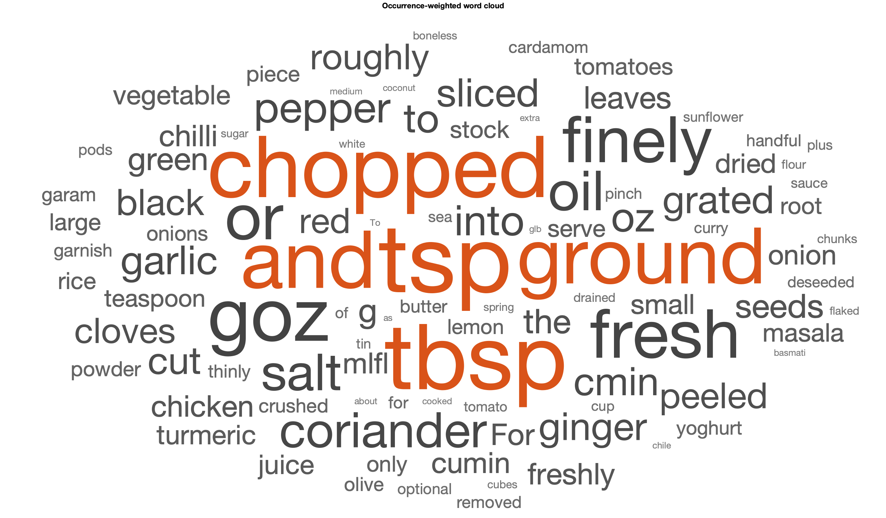

# Matlab SQL data mining and text analysis

Just for fun.
This repo contains a SQL database with my favorite recipes. I want to perform some text analysis and word clustering. Not sure yet what this will lead to. Would be cool to train some kind of model to give recipe suggestions, based on ingredients.




# Repo structure

```
.
|-- db
|   |-- db_struct.mat
|   |-- my_recipes.sqlite
|   `-- sql_demo.m
|-- drivers
|   |-- mssql-jdbc-8.2.2.jre8.jar
|   |-- mysql-connector-java-8.0.19.jar
|   |-- postgresql-42.2.11.jar
|   `-- sqlite-jdbc-3.30.1.jar
|-- figures
|   |-- ingredients_tsne.png
|   `-- ingredients_wordcloud.png
|-- functions
|   |-- SQLite2struct.m
|   `-- googleTranslateAPI.m
|-- README.md
|-- parse_database.m
`-- text_mining.m

4 directories, 14 files


This tree was created by the following command:
work@leidix:~$ tree --dirsfirst --charset=ascii .
```

